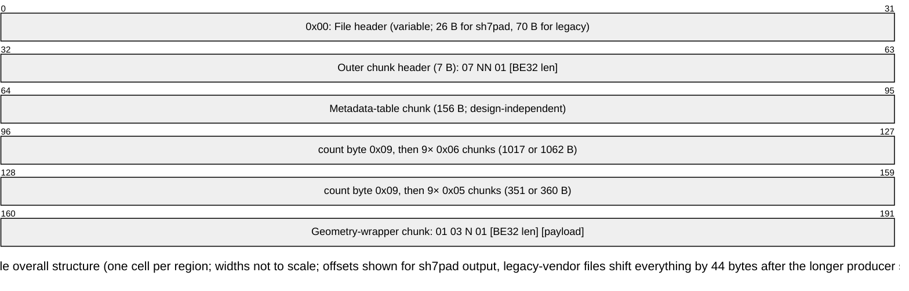
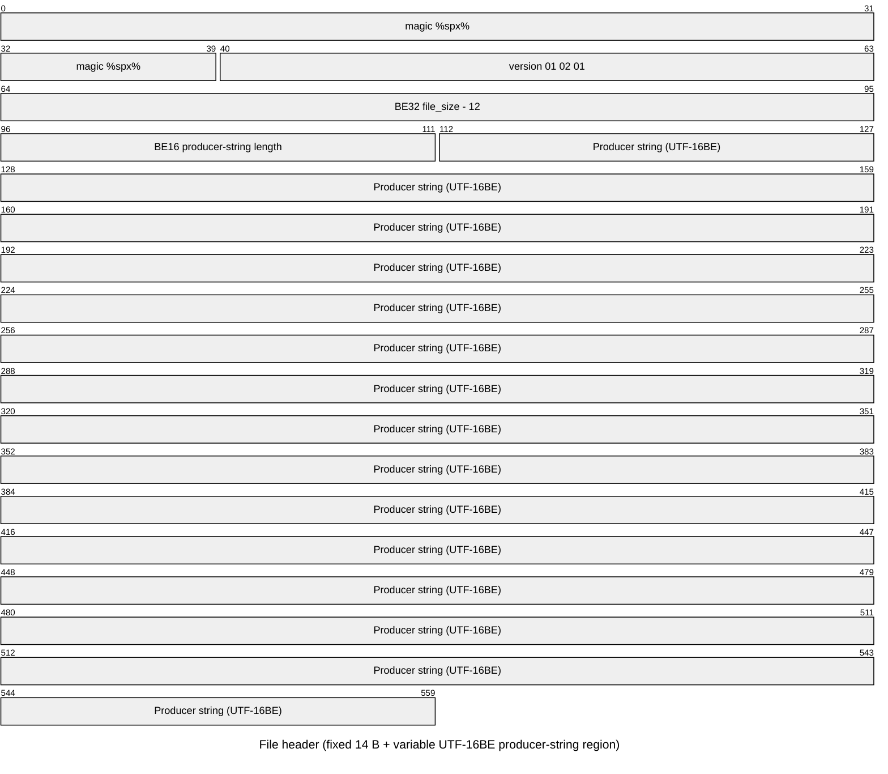
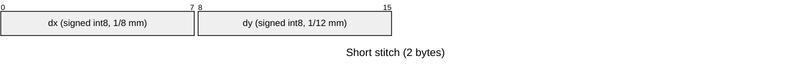
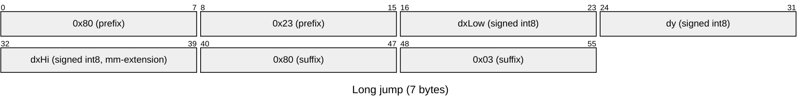
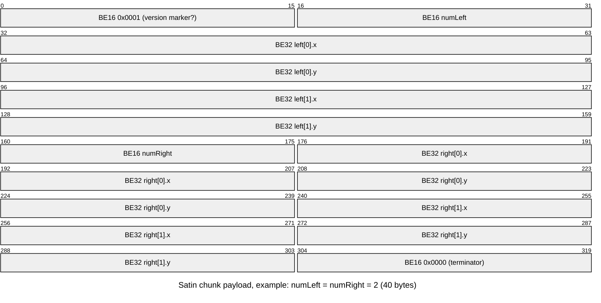
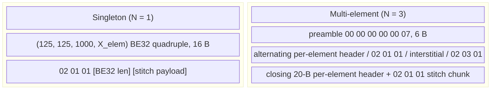
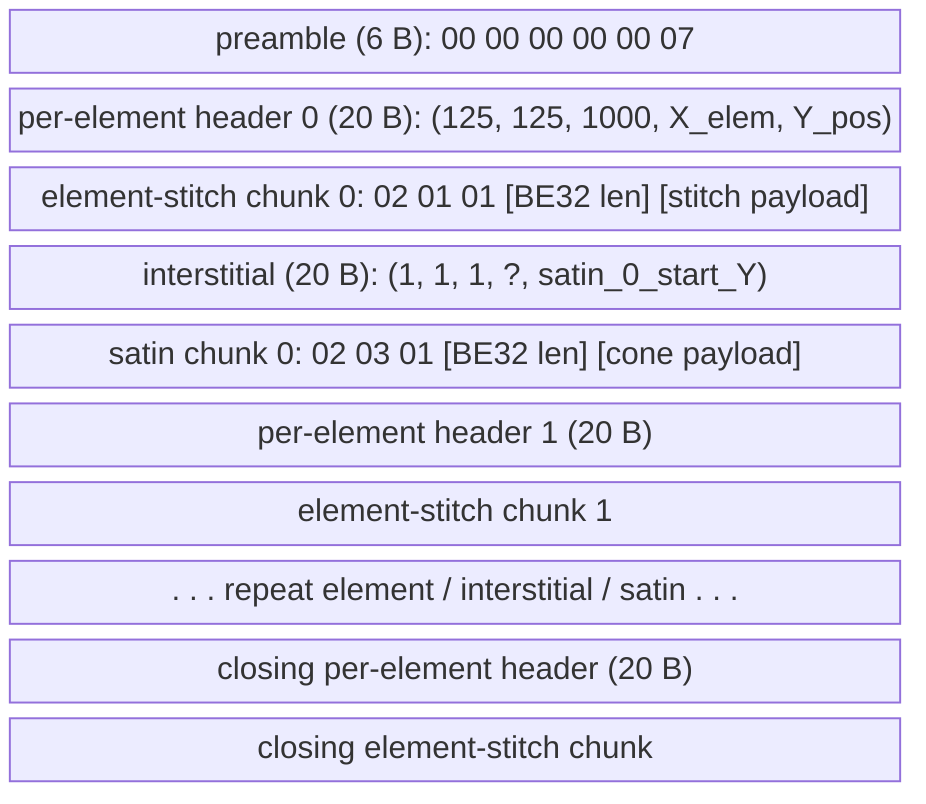

# .sh7 file format

`.sh7` is the decorative-stitch format produced by Husqvarna Viking
sewing machines. The format is generated by VSM Group's internal
`VSM_SD` library. No public specification exists; this document
describes the format as currently understood.

> Reverse-engineered from sample files and trial-and-error on my own
> machine. Results may therefore vary.

Each statement is labelled:

- **(verified)** when confirmed by machine probing or by end-to-end
  machine testing.
- **(observed)** when the same value or structure appears across every
  sample file we have but the firmware behaviour was not directly probed.
- **(assumed: ...)** when inferred, with a short note about the source of
  the assumption.

A cross-format comparison against the sibling VSM library outputs
(VP3, SHV, HUS, VIP) lives in
[`docs/research/cross-format-comparison.md`](docs/research/cross-format-comparison.md).
A declarative subset of this format in Kaitai Struct lives in
[`docs/format.ksy`](docs/format.ksy); feed it to `kaitai-struct-compiler`
to generate a parser in your preferred target language.

This document is a working format reference; rules an encoder must
follow to produce files the firmware accepts are interleaved with the
field descriptions below.

## Numbers and byte order

| Region | Endianness | Notes |
|--------|------------|-------|
| Multi-byte integers in chunk headers and payloads | Big-endian | (verified) |
| Strings | UTF-16BE | (verified) |
| Stitch-record deltas (`02 01 01` chunk) | Signed int8 (`dx`, `dy`) | (verified) |
| Satin-chunk coordinates (`02 03 01` chunk) | BE32, treated as unsigned by the firmware | (verified) |

Coordinate units:

| Where | X axis | Y axis |
|-------|--------|--------|
| Stitch deltas in `02 01 01` chunks | 1/8 mm per raw unit | 1/12 mm per raw unit |
| Satin chunk values in `02 03 01` chunks | X-axis scale (1/8 mm per raw stitch unit, 1000 file units = 8 raw stitch units) | same as X (the satin's local frame is uniform) |

The asymmetric stitch grid is unique to `.sh7` among related formats; VP3,
SHV, HUS, and VIP all use uniform per-axis scaling.

## Top-level layout

A `.sh7` file is six sequential regions:



The variable sizes in the `0x06` and `0x05` blocks are because the chunk
headers carry a class byte `n` which selects a parser variant. Singleton
designs use `n=1` throughout the file; multi-element designs use `n=3`
throughout. See [Class byte (`n`)](#class-byte-n) for the dispatch rule.

### File header (offset 0x00, length 14 + producer-string bytes)

The first 14 bytes are fixed; the producer-string region after them is
variable-length per the BE16 length at offset `0x0C`. sh7pad emits 12
bytes (`sh7pad` as UTF-16BE), legacy-vendor files emit 56 bytes.



| Offset | Size | Field | Notes |
|--------|------|-------|-------|
| 0x00 | 5 B | Magic `%spx%` | (verified) |
| 0x05 | 3 B | Version `01 02 01` | (observed) |
| 0x08 | 4 B | BE32 `file_size - 12` | (verified) |
| 0x0C | 2 B | BE16 producer-string byte length | (verified) firmware-decorative; sh7pad emits `0x0C` (= 12 bytes), original library files emit `0x38` (= 56 bytes) |
| 0x0E | variable | UTF-16BE producer string | (verified) firmware-decorative content; sh7pad defaults to `sh7pad` (12 bytes) |

### Outer chunk header

7 bytes, starts at offset `0x0E + producer-string byte length` (= `0x1A` for sh7pad output, `0x46` for original-library files).

| Field | Size | Value | Notes |
|-------|------|-------|-------|
| Tag | 1 B | `0x07` | (verified) |
| `NN` | 1 B | parser-dispatch enum (see below) | (verified) firmware rejects unexpected `NN` |
| Version | 1 B | `0x01` | (observed) |
| BE32 length | 4 B | Payload length in bytes | (verified) |

`NN` is a parser-dispatch enum (it selects which parser variant the
machine uses), not a count of elements or satins. Across the sample
files observed:

| `NN` | Used by |
|------|---------|
| `0x01` | most single-stitch designs |
| `0x05` | designs containing satin chunks |
| `0x02`, `0x07`, `0x08`, `0x09`, `0x0A`, `0x0B`, `0x0F` | various non-satin multi-element design classes |
| `0x0D`, `0x0E` | specific singleton design classes |

(verified) Patching a singleton's `NN` to an unexpected value makes
the machine display `[not supported class ID or version]`. Patching
a multi-stitch file's `NN` to a value that selects the single-stitch
parser makes it display `[Multiple number of StitchData]`. The full
mapping between `NN` and the machine's pattern-category groupings is
not yet decoded. Encoders should emit only `NN=1` (singleton) or
`NN=5` (multi-element with satin); other dispatch values are out of
scope here.

## Chunk envelope

Two header conventions:

| Tag | Header size | Layout |
|-----|-------------|--------|
| `0x02`, `0x05`, `0x06`, `0x07` | 7 bytes | `[tag] [n] [version] [BE32 length] [payload]` |
| `0x01` | 8 bytes | `[tag] [n] [version] [sub] [BE32 length] [payload]` |

The `sub` byte in `0x01`-tagged chunks is `0x01` in every observed
file. (observed)

Tags observed in the format:

| Tag | Meaning |
|-----|---------|
| `0x07` | Outer container (the whole design payload) |
| `0x01` | Parameter / wrapper block (8-byte header). Two appear per file: the metadata-table chunk and the geometry-wrapper chunk |
| `0x06` | Per-slot metadata (9 chunks per file) |
| `0x05` | Per-slot record (9 chunks per file) |
| `0x02` | Stitch geometry. Subtype on the `n` byte: `02 01 01` is short/jump stitches, `02 03 01` is a satin cone |

A single byte `0x09` separates the metadata-table chunk from the 0x06
block, and the 0x06 block from the 0x05 block. (observed)

## Class byte (`n`)

The `n` byte (the second byte of every chunk header) selects a parser
variant. Two classes are observed:

| Class | Used by | Chunk variants |
|-------|---------|----------------|
| `1` (singleton) | Single-element designs | `07 01 01`, `06 01 02`, `05 01 02`, `01 03 01 01` |
| `3` (multi-element) | Designs with at least one satin chunk | `07 NN 01` (NN ≥ 2), `06 03 02`, `05 03 02`, `01 03 03 01` |

Mixing classes within a single file makes the machine display
`Not supported SDC`, and repeated mismatches crash the application.
(verified) Every chunk in a file must therefore share the same class
byte.

## Metadata-table chunk (`01 08 01 01`)

156 bytes total: 8-byte header (`01 08 01 01 [BE32 0x94]`) plus a
148-byte payload. (observed) The payload is design-independent.

Payload structure:

| Offset | Size | Content |
|--------|------|---------|
| 0x00 | 4 B | BE32 record count = 9 |
| 0x04 | 144 B | 9 records, each 16 bytes (4 BE32 fields) |

Record values:

```
R[0]   = (0,   1, 1, 1)
R[k]   = (k-1, k, k, 0)   for k = 1..8
```

(observed) Constant across files. (verified) Zeroing the payload
causes the firmware to reject the file.

## 0x06 chunks (per-slot metadata)

Nine chunks per file, immediately after the metadata-table chunk's
trailing `0x09` byte.

Class-dependent envelope:

| Class | Header | Payload size |
|-------|--------|--------------|
| `n=1` (singleton) | `06 01 02 [BE32 0x6F]` | 111 bytes |
| `n=3` (multi-element) | `06 03 02 [BE32 0x6A]` | 106 bytes |

The two variants share the same prefix layout (offsets `+0x00` to
`+0x2B` of the payload). The X-dimension fields and the slot-pattern
byte sit at different offsets in the multi-element variant.

### Per-design fields

All offsets are payload offsets unless noted otherwise.

| Offset | Size | Type | Field | Notes |
|--------|------|------|-------|-------|
| `+0x05` | 1 B | u8 | Suggested presser foot | (verified) see foot-byte table below |
| `+0x0F` | 1 B | u8 | Thread tension; displayed as `byte / 10` | (verified) |
| `+0x1D` | 2 B | BE16 | `val[0]` | (verified) firmware-read; semantics unknown but design-specific |
| `+0x21` | 2 B | BE16 | Y dimension in µm | (verified) drives displayed height |
| `+0x25` | 2 B | BE16 | Y dimension in µm × 1.5 | (verified) firmware red-highlights Y when this disagrees with `+0x21` |
| `+0x28` | 4 B | BE32 | `val[0]` mirror as BE32 | (observed) always equals the BE16 at `+0x1D` |
| `+0x50` (singleton) / `+0x48` (multi) | 4 B | BE32 | X dimension in µm | (verified) drives displayed width |
| `+0x54` (singleton) / `+0x4C` (multi) | 4 B | BE32 | X dimension in µm (mirror) | (verified) firmware red-highlights X when this disagrees with the previous field |
| `+0x6D` (singleton) / `+0x68` (multi) | 1 B | u8 | Slot-pattern byte: `60, 60, 60, 60, 45, 30, 30, 45, 45` for slots 0..8 | (observed) |

Slot 3 carries `tension + 6` instead of `tension`. (observed)

Y dimension is capped at `floor(0xFFFF / 1.5) µm`, about 43.6 mm,
because `val[2] = Y_µm × 1.5` is BE16. (verified)

### Foot byte mappings

(verified)

| Byte | Foot |
|------|------|
| `0x01` | Foot A |
| `0x02` | Foot B (Decorative) |
| `0x03` | Foot C |
| `0x06` | Foot J |
| `0x07` | Foot S (Side-motion) |
| `0xFF` | No suggestion |

Other values are untested.

### Unmapped bytes

Payload offsets `+0x2C` through end (excluding the design-specific
fields above) carry round numbers (e.g. 1000000, 1000, 2000, 5000)
and a fixed signature `0x02000000`. The exact field-by-field meanings
are not yet mapped.

## 0x05 chunks (per-slot records)

Nine chunks per file, immediately after the 0x06 block's trailing
`0x09` byte.

Class-dependent envelope:

| Class | Header | Payload size |
|-------|--------|--------------|
| `n=1` (singleton) | `05 01 02 [BE32 0x20]` | 32 bytes |
| `n=3` (multi-element) | `05 03 02 [BE32 0x21]` | 33 bytes |

### Per-design fields (singleton, `n=1`)

| Offset | Size | Type | Field | Notes |
|--------|------|------|-------|-------|
| `+0x04` | 4 B | BE32 | `X_elem` (matches geometry-wrapper `X`) | (observed) firmware-tolerant of any value |
| `+0x10` | 1 B | u8 | Thread tension (slot 3 carries `tension + 6`) | (verified) |
| `+0x11` | 4 B | BE32 | Y dimension in µm | (verified) |
| `+0x15` | 4 B | BE32 | X dimension in µm | (verified) |
| `+0x1E` | 1 B | u8 | Slot-pattern byte: `60, 60, 60, 60, 45, 30, 30, 45, 45` | (observed) |

### Per-design fields (multi-element, `n=3`)

The multi-element layout has the slot-pattern byte at `+0x1F`; the
marker byte `0x02` sits at `+0x1E`.

| Offset | Size | Type | Field | Notes |
|--------|------|------|-------|-------|
| `+0x10` | 1 B | u8 | Thread tension (slot 3 carries `tension + 6`) | (verified) |
| `+0x11` | 4 B | BE32 | Y dimension in µm | (verified) |
| `+0x15` | 4 B | BE32 | X dimension in µm | (verified) |
| `+0x1E` | 1 B | u8 | Multi-element marker, always `0x02` | (observed) |
| `+0x1F` | 1 B | u8 | Slot-pattern byte | (observed) |
| `+0x20` | 1 B | u8 | Trailing zero | (observed) |

Writing the slot pattern at `+0x1E` (the singleton offset) instead of
`+0x1F` overwrites the multi-element marker and triggers a
stitch-generator failure on the machine. (verified)

## Stitch chunk (`02 01 01`)

Payload is a stream of stitch records, each one either a short stitch
(2 bytes) or a long-jump record (7 bytes). The decoder peeks the first
byte: `0x80` introduces a long-jump record, anything else is a short
stitch.

### Short stitch (2 bytes)



| Offset | Size | Type | Field |
|--------|------|------|-------|
| 0 | 1 B | int8 | `dx` (1/8 mm) |
| 1 | 1 B | int8 | `dy` (1/12 mm) |

A short stitch with `dx = -128` is invalid; byte `0x80` collides with
the long-jump prefix. (verified) Encoders must clamp `dx` to
`-127..127` and split any longer move into multiple records.

### Long jump (7 bytes)



| Offset | Size | Type | Field |
|--------|------|------|-------|
| 0..1 | 2 B | | Prefix `80 23` |
| 2 | 1 B | int8 | `dxLow` |
| 3 | 1 B | int8 | `dy` (regular Y delta) |
| 4 | 1 B | int8 | `dxHi` (millimetre extension of `dx`) |
| 5..6 | 2 B | | Suffix `80 03` |

Effective X delta: `dxLow + dxHi × 8`. `|dxHi|` is always 0 or 1
across observed files. (observed)

## Satin chunk (`02 03 01`)

Encodes a cone-shaped fill via two outline curves (the left and right
edges of the cone). The cone's local frame is uniform-scale; both axes
of the BE32 values map to raw stitch units through the X-axis scale
(see [Numbers and byte order](#numbers-and-byte-order)).



Payload layout:

| Offset | Size | Field | Notes |
|--------|------|-------|-------|
| 0 | 2 B | BE16 leading marker | (observed) always `0x0001` |
| 2 | 2 B | BE16 `numLeft` | Number of points on the left edge |
| 4 | `numLeft × 8` B | Left-edge points: `[BE32 x, BE32 y]` per point | |
| 4 + `numLeft × 8` | 2 B | BE16 `numRight` | (observed) always equal to `numLeft` |
| ... | `numRight × 8` B | Right-edge points: `[BE32 x, BE32 y]` per point | |
| ... | 2 B | BE16 trailer | (observed) always `0x0000` |

(observed) `numLeft == numRight`, and the two sides share Y values, so
each Y level is a "rung" with width `right.x - left.x`.

All BE32 values must be non-negative; the firmware reads them as
unsigned. Encoders that subtract the design's `minX` / `minY` from
each coordinate keep the values positive automatically. (verified)

### Anchor and chaining

In multi-element files:

- `left[0]` is the cone's chain entry corner (top-left). Its world
  position equals the chain position left by the previous block.
- `right[last]` is the chain exit corner (bottom-right). The next
  block's chain entry is taken from this point.

The parser uses `left[0]` as the anchor: every other point is
positioned in world space as `chain + (point - left[0])` after scale
conversion.

### Spine orientation

The format imposes no monotonicity on the cone's points beyond the
non-negative constraint. (assumed: from format definition.) Whether
the firmware accepts non-downward cones has not been probed; every
observed sample file uses cones whose Y monotonically increases from
`left[0]` to `right[last]`.

## Geometry-wrapper chunk (`01 03 N 01`)

The last chunk in the outer payload. The class byte `N` (third byte of
the header) determines the payload layout.



### Singleton wrapper (N = 1)

Header: `01 03 01 01 [BE32 length]`.

Payload:

| Offset | Size | Field |
|--------|------|-------|
| 0..15 | 16 B | BE32 quadruple `(125, 125, 1000, X_elem)` |
| 16.. | varies | One `02 01 01` stitch chunk |

`(125, 125, 1000)` is constant across observed files. (observed)
`X_elem` is firmware-tolerant of any value in singletons. (verified)

### Multi-element wrapper (N = 3)

Header: `01 03 03 01 [BE32 length]`.



Payload layout:

| Region | Size | Content |
|--------|------|---------|
| Preamble | 6 B | `00 00 00 00 00 07` |
| Per-element header (one before every `02 01 01` chunk) | 20 B | BE32 quintuple `(125, 125, 1000, X_elem, Y_pos)` |
| Element-stitch chunk | varies | `02 01 01 [BE32 length] [payload]` |
| Interstitial (one between every `02 01 01` and following `02 03 01`) | 20 B | BE32 quintuple `(1, 1, 1, A, satin_start_Y)` |
| Satin chunk | varies | `02 03 01 [BE32 length] [payload]` |
| ... | | Pattern repeats |

The wrapper always ends with a `02 01 01` chunk. (observed) If the
final block is a satin, encoders emit a synthetic closing
element-stitch chunk with a single `(0, 0)` no-op short to satisfy
this rule.

### Per-element header fields

| Field | Type | Value | Notes |
|-------|------|-------|-------|
| `(125, 125, 1000)` | 3 × BE32 | constants | (observed) Distinguishes the per-element header from the satin interstitial, which uses `(1, 1, 1)`. |
| `X_elem` | BE32 | `(chain_X_at_element_start − design.minX) × 1000` µm | (observed) Reproduces all 4 values in the multi-element reference design with zero residual; reproduces about half of the observed NN=5 samples, with the rest concentrated in decorative-stitch categories whose semantics differ. Setting to `0` causes stitch-generator failures on the machine. (verified, reference design) |
| `Y_pos` | BE32 | `(chain_Y_at_element_start − design.minY) × 1500` µm | (observed) Element 0 has `Y_pos = 0` when the design starts at `y = minY`. Same caveat as `X_elem`: holds for the reference design, not universal across observed samples. |

The shift by `−design.minX` (and `−design.minY`) keeps the BE32
unsigned, mirroring the same idiom used inside satin chunks and
analogous to VP3's `start_position_from_center_x = first_pos_x −
center_x` per-color-block field. Coordinates are in X-stitch-scale
µm (X axis: 1000 µm/mm; Y axis: 1500 µm/mm).

### Interstitial fields

The 20 bytes between an element-stitch chunk and the next satin
chunk. (observed)

| Field | Type | Value | Notes |
|-------|------|-------|-------|
| `(1, 1, 1)` | 3 × BE32 | constants | (observed) Distinguishes the satin interstitial from the per-element header, which uses `(125, 125, 1000)`. |
| `cone_anchor_X` | BE32 | `(cone's world minX − design.minX) × 1000` µm | (observed) Reproduces all 3 satin values in the multi-element reference design with zero residual; reproduces roughly half of the observed NN=5 samples, with the rest concentrated in decorative-stitch categories. (verified, reference design) |
| `satin_start_Y` | BE32 | `(chain_Y_at_satin_start − design.minY) × 1500` µm | (observed) Same scope caveat as `cone_anchor_X`. |

The deltas between successive `satin_start_Y` and the next
element's `Y_pos` give each satin's local-frame Y span exactly.

## Related file formats

`.sh7` is part of the VSM library family that also produces VP3, SHV,
HUS, and VIP. Detailed cross-format mappings are in
[`docs/research/cross-format-comparison.md`](docs/research/cross-format-comparison.md).
Brief pointers:

| `.sh7` feature | Closest related-format counterpart |
|----------------|------------------------------------|
| Magic `%spx%` | VP3 magic `%vsm%` (same shape, different codename) |
| `0x80` long-jump prefix | Identical convention in VP3 and SHV |
| Nested chunks `[tag][n][version][BE32 length]` | VP3 uses 3-byte tags `0 N 0` with similar nesting |
| Asymmetric 1/8 mm × 1/12 mm grid | Unique to `.sh7`; VP3, SHV, HUS, VIP use uniform per-axis scaling |
| `0x06` chunk dimension fields | Structurally analogous to VP3's hoop-centred packet |
| Satin chunk (`02 03 01`) | No direct counterpart in any related format |
