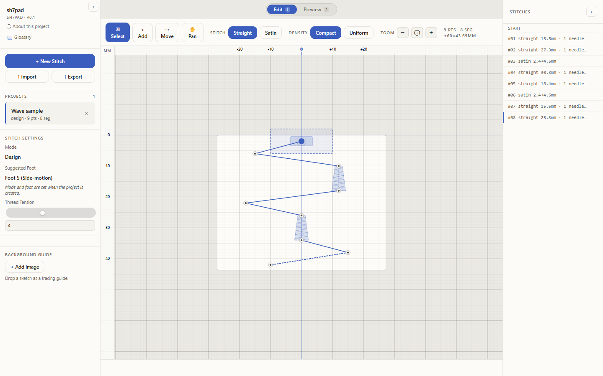
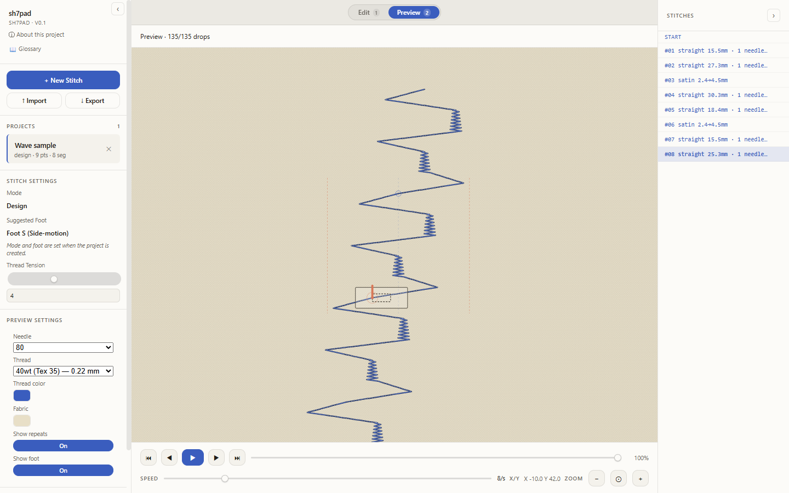

# sh7pad

Browser-based viewer, creator, and editor for `.sh7` decorative-stitch
files. Runs entirely client-side; no upload, no server.

Live at <https://vortiago.github.io/sh7pad/>.

> Hobby project, not affiliated with Husqvarna Viking. The `.sh7`
> format here is reverse-engineered from sample files and trial-and-error
> on my own sewing machine. Treat every export as experimental; test on
> a small piece of fabric first.

## Edit and preview

Two panes share the same project. **Edit** is a vector canvas for
placing points and joining them with straight or satin segments.
**Preview** simulates the stitched result (needle drops, thread
thickness, fabric colour, design repeats) and gives you a transport
to scrub through it.





## What's in here

- **Design mode** places points and connects them with straight or
  satin segments; the encoder generates the needle drops between them,
  including the zigzag fill inside satin cones.
- **Manual mode** drops every needle and jump stitch by hand, for
  patterns the design-mode encoder is too opinionated about.
- Imports and exports both `.sh7` (the binary the machine reads) and
  `.sh7c.json` (a project wrapper that round-trips in-progress designs).
- Projects persist in IndexedDB. No accounts, no servers, no telemetry.

The reverse-engineered format reference lives in
[FORMAT.md](FORMAT.md), with cross-format notes against VP3, SHV, HUS,
and VIP under [`docs/research/`](docs/research/) and a Kaitai Struct
subset at [`docs/format.ksy`](docs/format.ksy).

## Develop locally

```sh
npm ci
npm run dev          # vite dev server at http://localhost:5173/sh7pad/
npm test             # vitest unit + integration suite
npm run build        # production build (writes to dist/)
npm run test:e2e     # playwright e2e (first run: `npx playwright install chromium`)
```

Requires Node 24+.

## Contributing

See [CONTRIBUTING.md](CONTRIBUTING.md). PRs and bug reports both
welcome; the most useful bug reports are "this file misbehaves on my
machine" with a short hex excerpt and the project export.
[SECURITY.md](SECURITY.md) covers how to report security issues.

## License

MIT. See [LICENSE](LICENSE).
