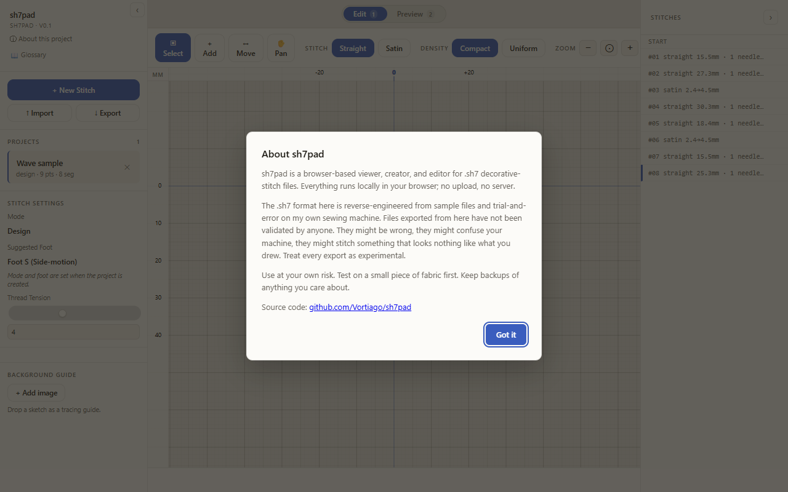
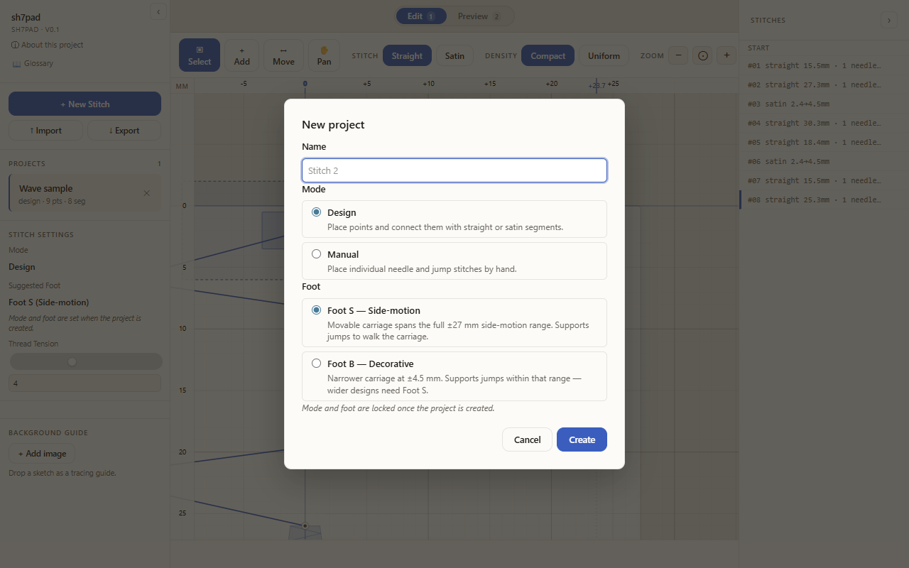
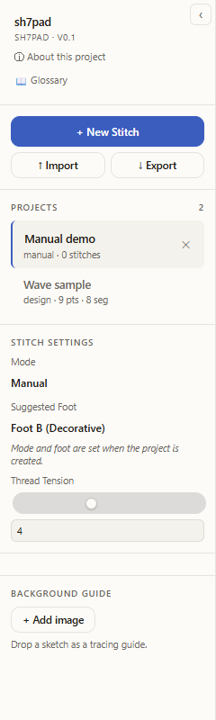
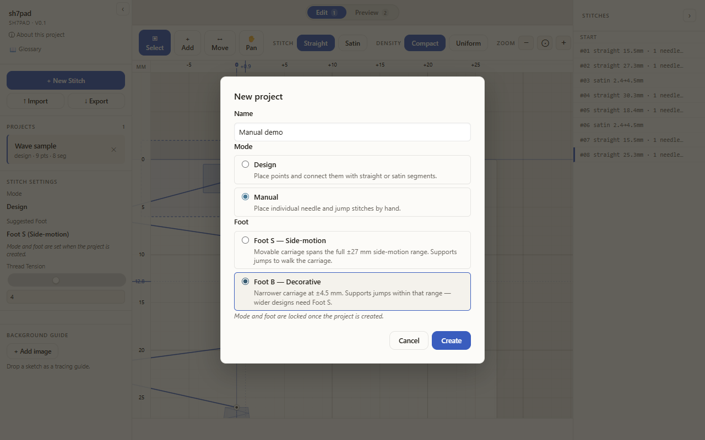
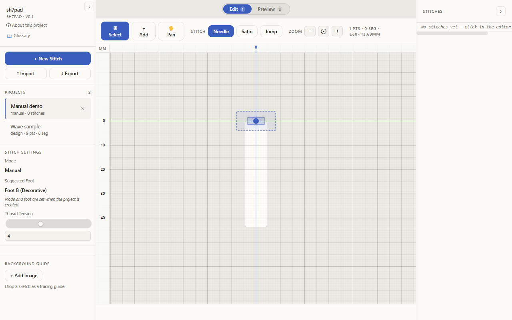
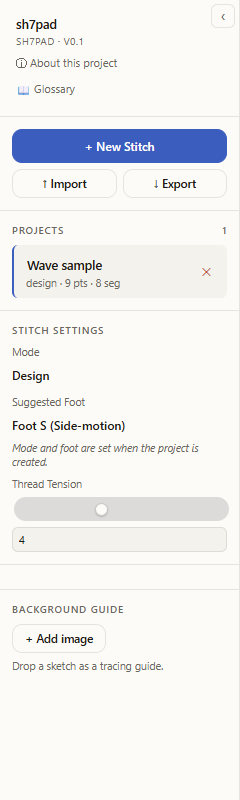

# Create a design

## Open the app

1. Go to `/sh7pad/`. The disclaimer opens automatically and the Wave sample project loads behind it.
2. Click **Got it** to dismiss the disclaimer. The dismissal is remembered; reloads will not show it again.

## Create a design-mode project

1. In the left sidebar, click **+ New Stitch**. The New Project dialog opens with focus on the name input.
2. Leave the suggested name (for example `Stitch 2`) or type your own.
3. Confirm the defaults: Mode = **Design**, Foot = **S (Side-motion)**.
4. Click **Create**.

The dialog closes, the new project appears in the sidebar **Projects** list with a blue active border, and the toolbar stats reset to `0 pts · 0 seg`.

## Create a manual-mode project

Manual mode is for stitching by hand on the machine. The toolbar swaps the Move tool for Needle/Satin/Jump buttons.

1. Click **+ New Stitch**.
2. Type a name, for example `Manual demo`.
3. Click the **Manual** option under MODE.
4. Click **Foot B (Decorative)** under SUGGESTED FOOT.
5. Click **Create**.

After creation, the editor shows an empty canvas and the toolbar STITCH group reads **Needle · Satin · Jump**.

Note: Mode and foot are locked once a project is created. To change them, make a new project.

## Rename a project

1. In the sidebar, click into the **Project name** text box on the project you want to rename.
2. Type the new name.
3. Press **Enter** (or click elsewhere) to commit. The change persists to local storage.

## Delete a project

1. In the sidebar row for the project, click the **✕** button on the right.
2. The browser asks `Delete this project?`. Click **OK** to confirm.

After delete, the row disappears, the project count drops by one, and another project becomes active. Deleting the last project removes it without auto-creating a replacement.

## Troubleshooting

- The disclaimer keeps reappearing after dismissal: your browser is clearing `localStorage` for this origin. Check site permissions and any privacy extensions.
- The new project does not appear: confirm the dialog closed cleanly. If it stayed open, the name field was likely empty; type something and click Create again.
- The delete confirm did nothing: the dialog uses the native browser confirm. Clicking **Cancel** aborts; only **OK** removes the project.
