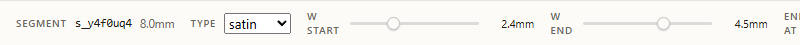
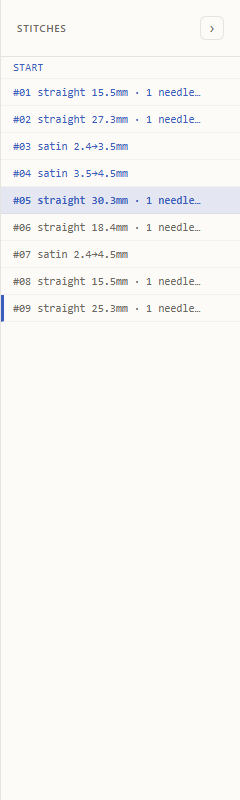
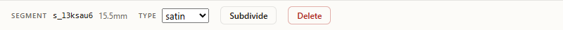
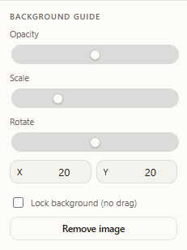
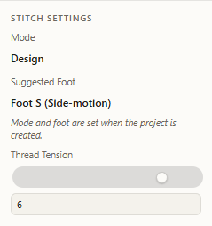

# Edit a design

Edit mode is where you place points, change segment types, and tune widths. Everything in this guide assumes the **Edit** tab is selected at the top of the canvas.

## The stitch list

The right rail (**Stitches**) shows every segment in order. Each row has the segment number, type, length, and the per-segment needle/jump count for straight segments.

- Click a row to select that segment. The row highlights and the **SEGMENT** inspector on the canvas opens for it.
- Click the **×** at the end of a row to delete that segment.
- The first row (**START**) is the carriage's design-start anchor; you can drag it on the canvas to shift where stitching begins.

## Edit a satin segment

1. In the right rail, click a satin row (the Wave sample's row `#03 satin 2.4 to 4.5mm`).
2. The inspector opens with the segment id, length, type select, **W START** and **W END** sliders, **END AT** select, **Subdivide** and **Delete** buttons.

3. Drag **W START** to change the segment's starting width. The slider reads the value live (for example `3.0mm`) and the row label rebuilds to match.
4. Drag **W END** the same way to change the ending width.
5. Change **END AT** to flip the satin's final stop between left and right.

## Subdivide a satin segment

1. Select the satin row.
2. Click **Subdivide**. The segment splits in two at its midpoint; both halves keep the satin type.
3. The stitch list now has one extra row, and the toolbar stats jump by one segment and one point.

To merge them back, delete one of the two halves with its **×** button or with **Delete** in the inspector.

## Flip a straight segment to satin

1. Select a straight row, for example `#01 straight`.
2. In the inspector, change the **TYPE** select from `straight` to `satin`.
3. The inspector body rebuilds: **W START**, **W END**, **END AT**, **Subdivide**, and **Delete** appear.
4. The stitch list row text updates from `#01 straight ...mm` to `#01 satin <width> to <width>mm`.

To revert, change **TYPE** back to `straight`; the width sliders disappear and the row label returns to its straight form.

## Toggle DENSITY

The DENSITY toolgroup on the toolbar decides how segments are sliced into needle drops.

1. **Compact** (default) packs drops as tightly as the encoder allows.
2. **Uniform** spaces drops evenly along the segment.

Click either button to switch. The change applies immediately; switch to Preview to compare drop counts.

The density choice is stored per project and survives reload.

## Add a background tracing image

Use the **Background Guide** section in the sidebar to load a sketch and trace it.

1. Click **+ Add image**. A file picker opens; pick a PNG, JPG, or any image format your browser supports.
2. The section swaps to controls: **Opacity**, **Scale**, **Rotate** sliders, **X** and **Y** number inputs, a **Lock** checkbox, and a **Remove image** button.

3. Drag **Opacity** down (toward 0) to fade the image so the stitch lines stay readable.
4. Use **Scale** and **Rotate** to size and orient the image over your design.
5. Drag the image directly on the canvas to position it, or type into the **X** and **Y** inputs for precise placement.
6. Tick **Lock** to stop the canvas from picking up the image on pointer drags; this protects against nudging it while editing stitches.
7. Click **Remove image** to clear the tracing image and return to the **+ Add image** button.

Background images are stored as blobs in the same browser database as the project.

## Adjust thread tension

Thread tension lives in the sidebar **Stitch Settings** section.

1. Drag the **Thread Tension** range slider, or type into the number input next to it. The two controls stay in sync.
2. The value clamps inside the supported range.
3. Reload the page; the tension you set is still there.

## Troubleshooting

- The inspector is empty: no segment is selected. Click any row other than **START** in the stitch list.
- Width sliders are missing on a satin row: the row's **TYPE** select is set to `straight`. Change it to `satin` and the sliders return.
- The background image will not move: the **Lock** checkbox is ticked. Untick it to drag the image again.
- Thread Tension snaps back to a boundary value: you typed a number outside the allowed range; it clamps to the nearest valid value.
