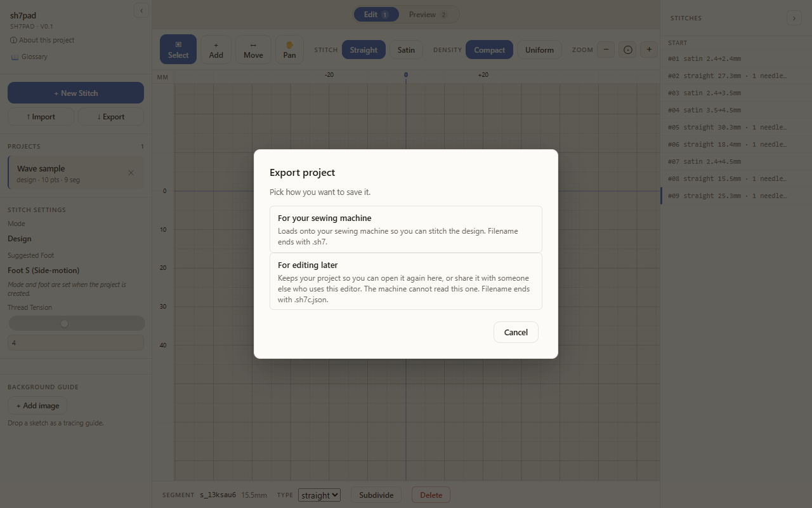

# Export a design

Export saves the active project as a file you can keep, share, or load onto a sewing machine.

## Open the app

1. Go to `/sh7pad/`.
2. Click **Got it** on the disclaimer.

## Pick the project to export

1. In the sidebar **Projects** list, click the row of the project you want to export. It becomes the active row.

## Open the Export dialog

1. Click the **↓ Export** button in the sidebar action row.

The Export dialog opens with two options.

## Choose a format

| Option | File extension | Use when |
| --- | --- | --- |
| Binary stitch file | `.sh7` | You want to load the file onto the sewing machine. |
| JSON snapshot | `.sh7c.json` | You want a human-readable backup, or you want to diff two versions. |

1. Click the **.sh7** option. The dialog closes and your browser downloads a file ending in `.sh7`.
2. To get the JSON, click **↓ Export** again and pick the second option. The download ends in `.sh7c.json`.
3. To close the dialog without exporting, press **Escape** or click **Cancel**. No file is written.

## Caveats

- The `.sh7` format is reverse-engineered from sample files. Exports have not been validated against an official toolchain. Test on a small piece of fabric before committing to a project.
- Filenames come from the project name. Rename the project before exporting if you want a different filename.
- Exports run entirely in your browser. Nothing is uploaded.

## Troubleshooting

- Nothing downloads: your browser blocked the file. Check the address bar for a blocked-download icon, and allow downloads from this origin.
- The file is empty or the machine rejects it: the project may have zero segments. Switch to Edit, add at least one stitch, and export again.
- The filename has a generic suffix: the project still uses its auto-generated name. Rename it in the sidebar, then re-export.
