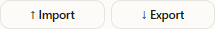

# Import a design

Import loads an existing sh7pad file into the editor as a new project. Your existing projects stay where they are.

## Supported file types

The import file picker accepts:

- `.sh7`: binary stitch file (the format a sewing machine reads).
- `.sh7c`: container variant.
- `.sh7c.json`: JSON snapshot exported from this app.
- `.json`: a plain JSON snapshot, treated the same as `.sh7c.json`.

## Open the app

1. Go to `/sh7pad/`.
2. Click **Got it** on the disclaimer.

## Import a file

1. Click the **↑ Import** button in the sidebar action row.

2. Pick a file in the OS file picker. The base filename (without extension) becomes the project's starting name.
3. The new project appears in the **Projects** list and is set as the active project. The toolbar stats update to its point and segment count.

## What happens on import

- `.sh7` files are read as binary and decoded.
- `.sh7c.json` and `.json` files are read as text and parsed.
- Existing projects are not overwritten; each import adds a new row.

## A note on storage

Imported projects live in the same browser-local database as projects you create in the app. Reload the page and they will still be there. Clearing site data, switching browsers, or switching profiles will remove them. Re-export the file if you want a copy you can move.

## Troubleshooting

- The file picker accepts the file but nothing happens: the file may be empty or the contents do not match any supported format. Re-export from the source app if you can.
- Numbers look off after import: check whether the source used a different foot or mode. Mode and foot are locked once a project exists; create a new project in the correct mode and re-import the data if needed.
- The imported name is wrong: rename the project in the sidebar (see [create-design.md](create-design.md)).
