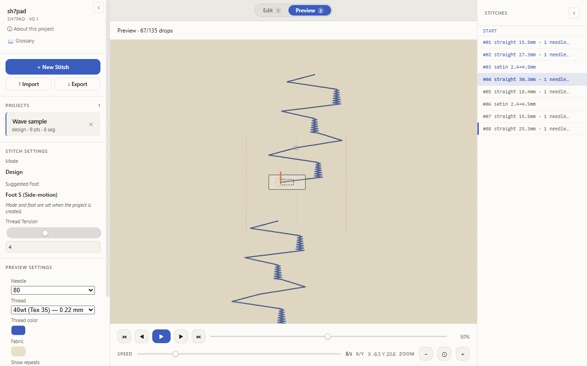
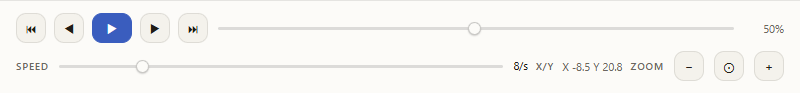
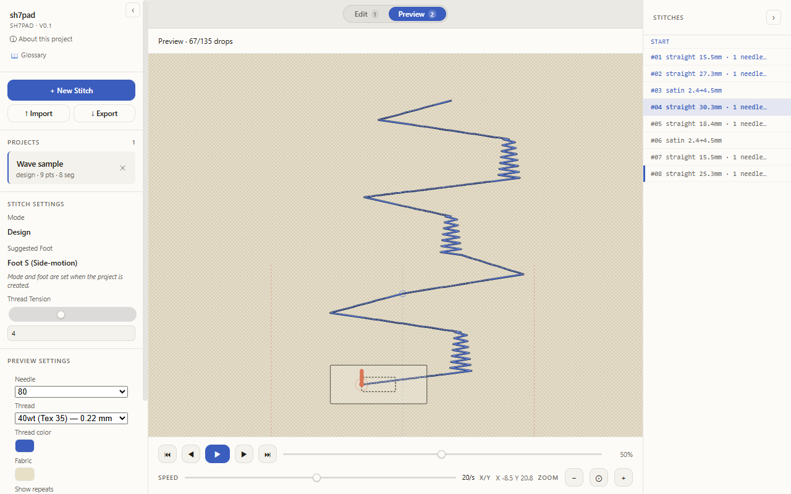
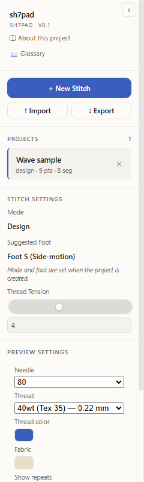

# Preview a design

Preview shows how the design will stitch out, drop by drop. The canvas stays read-only while you are in this mode; edits go back through Edit mode.

## Open the app

1. Go to `/sh7pad/`.
2. Click **Got it** on the disclaimer.

## Switch to Preview

1. Pick the project you want to preview in the sidebar **Projects** list.
2. Click the **Preview** tab in the top bar (or press `2`). The drop counter near the top reads `Preview · 0/<total> drops`.
3. To return to editing, click the **Edit** tab (or press `1`).

## Play, pause, and scrub

The transport row sits at the bottom of the Preview pane.

1. Click **▶** to start playback. The same button flips to **❚❚** while playing.
2. Click **❚❚** to pause. The drop counter and X/Y readout hold the current step.
3. Drag the scrub slider to jump to any point. Drop count and X/Y update as you drag.
4. Click **⏮** to return to the start, **⏭** to jump to the end.

## Change playback speed

The **SPEED** slider sits on the right side of the transport row. It runs from 1 to 20 drops per second; the default is `8/s`.

1. Drag the speed slider to the value you want. The readout next to the slider updates live.
2. Resume playback. The carriage advances at the new rate.

## Zoom in and out

1. Click **+** in the transport ZOOM group to zoom in.
2. Click **−** to zoom out.
3. Click **⊙** to reset back to the fit-to-pane view.

Mouse-wheel zoom over the canvas works in tandem with these buttons.

## Tune the Preview Settings panel

The sidebar swaps in a **Preview Settings** section while Preview mode is active.

| Control | Effect |
| --- | --- |
| Needle | Picks the simulated needle size (60 to 110). Thicker needles draw a wider hole. |
| Thread | Sets the simulated thread weight from 80wt (0.15 mm) to 20wt (0.40 mm). |
| Thread color | Hex color picker for the stitched thread on the canvas. |
| Fabric | Hex color picker for the background fabric color. |
| Show repeats | When **On**, draws the design's left and right repeats faded around the centre. Toggle **Off** to see only the active pattern unit. |
| Show foot | When **On**, draws the glass-foot overlay around the carriage. Toggle **Off** to expose the raw stitch path. |

Changes apply live; there is no Apply button. Settings stay attached to the project.

## Troubleshooting

- Playback will not start: scrub the slider away from the very end of the design and try **▶** again.
- The canvas looks blank: confirm the project has segments. Switch back to **Edit** and add points or import an existing file.
- The thread-color picker closes when you nudge another control: open it again; the underlying refresh does not destroy your in-progress choice.
