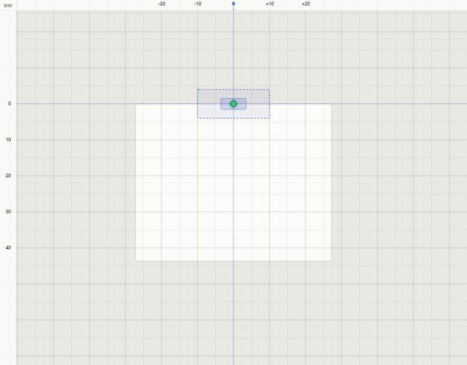
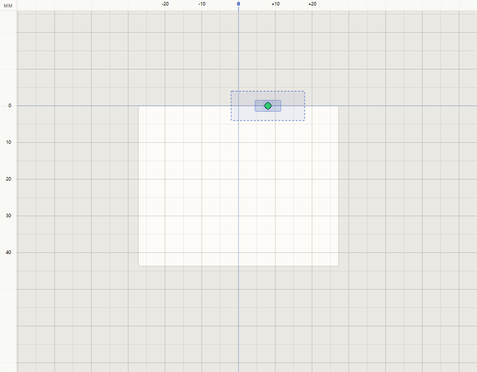
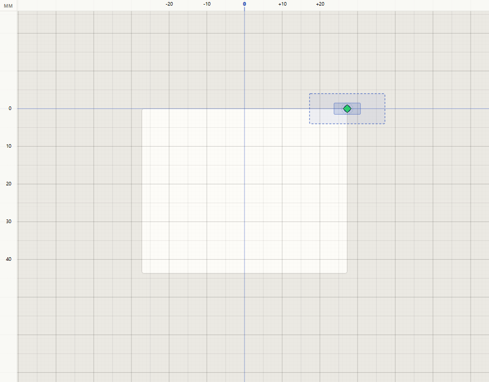
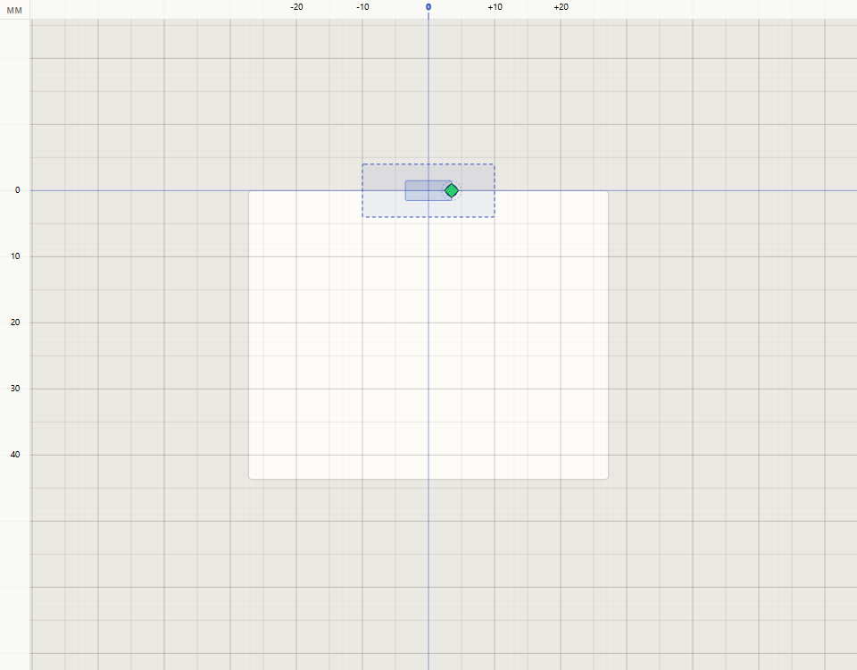
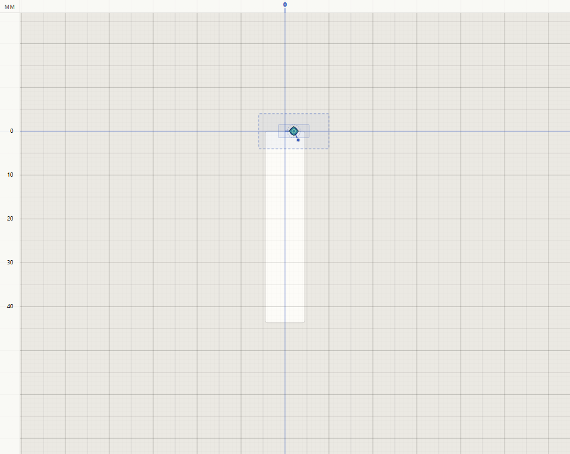

# Start Stitch and Carriage Start

Every project begins with two handles in the editor canvas: the **Carriage Start** (the dashed foot icon) and the **Start Stitch** (a green diamond inside the foot's Needle Slot). They control where the carriage parks before stitching begins and where the first needle drops.

## The two handles at a glance

The dashed rectangle is the **Foot Frame** (the presser foot's outer shape). The lighter rectangle inside it is the **Needle Slot** (the region the needle can physically reach). The green diamond is the Start Stitch.

- **Carriage Start**: the X position the carriage holds before the first machine record runs. Bounded by the foot's **Carriage Reach** (Foot B: 4.5 mm each side, Foot S: 27.25 mm each side).
- **Start Stitch**: where the first needle drops. Encoded as a real Needle Stitch in both Design Mode and Manual Mode. Its X is bounded by the Needle Slot (3.5 mm each side of the Carriage Start). Y is always 0.

In a fresh project both handles sit at the origin.

## Slide the Carriage Start

Click anywhere on the Foot Frame outside the Needle Slot and drag left or right. The carriage moves along the X axis and the Start Stitch rides along, keeping the same offset inside the Needle Slot.

The Start Stitch follows so the Needle Slot constraint cannot block carriage motion. If you want a different first-needle position relative to the foot, drag the diamond afterwards (see below).

## The Carriage Reach limit

Drag the Carriage Start far enough and it stops at the foot's reach limit. The Start Stitch is pulled along to the same position.

Foot B's reach is narrower than Foot S; if a design depends on a wide carriage offset, create the project with Foot S.

## Slide the Start Stitch

Click inside the Needle Slot (on the diamond or anywhere in the surrounding rectangle) and drag. The diamond moves; the Foot Frame stays put.

The diamond hard-stops at the Needle Slot edge (3.5 mm from the Carriage Start). This mirrors the machine, where the needle cannot leave the Needle Slot. To place the first needle further from the hoop centre, drag the Carriage Start first, then nudge the diamond inside the new Needle Slot position.

## Where the pointer routes

The two handles share the same visual space, so pointer routing splits them by region:

- Click inside the Needle Slot (the rectangle that holds the diamond) and you drag the Start Stitch.
- Click on the Foot Frame outside the Needle Slot and you drag the Carriage Start.

## The Start Lock (Manual Mode only)

In Manual Mode, both handles unlock until you place the first user Stitch. After that, the **Start Lock** engages: the foot icon dims, the diamond dims, and neither handle responds to dragging.

The lock exists because every Stitch you placed was validated against the Foot Frame in effect at that moment. Moving the Carriage Start or the Start Stitch retroactively would invalidate those checks. To start over, delete the project (or all manual stitches in it).

Design Mode never locks the handles: the encoder re-plans from scratch on every render, so the handles stay draggable throughout authoring.

## Exported file: the leading machine record

The Start Stitch is encoded as the first machine record in the exported `.sh7` file (a needle drop with `dy = 0` and `dx = startStitch.x` × 8). Importing a file you exported from sh7pad round-trips both handles to the same positions. Importing a foreign file with a needle-drop first record inside the Needle Slot consumes it as the Start Stitch; otherwise sh7pad synthesises a Start Stitch at (0, 0) and treats the file's first record as a regular stitch.

## Troubleshooting

- The diamond will not move past the Needle Slot edge: that is the hard stop. Slide the Carriage Start in the same direction to extend the reachable area.
- The foot icon stops short of where you dragged: it hit the Carriage Reach limit for the active foot. Foot S reaches further than Foot B.
- Neither handle responds to a drag in Manual Mode: the Start Lock is on. Look for the dimmed handle styling. Remove user stitches to unlock, or create a new Manual project.
- The first stitch in an imported file is not where you expected: the importer treats a first record that does not fit inside the Needle Slot as a regular stitch and seeds a Start Stitch at (0, 0). Check that the source file's first needle drop sits within 3.5 mm of its Carriage Start.
